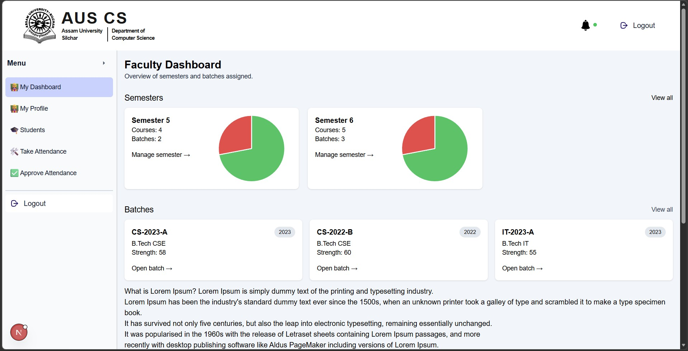
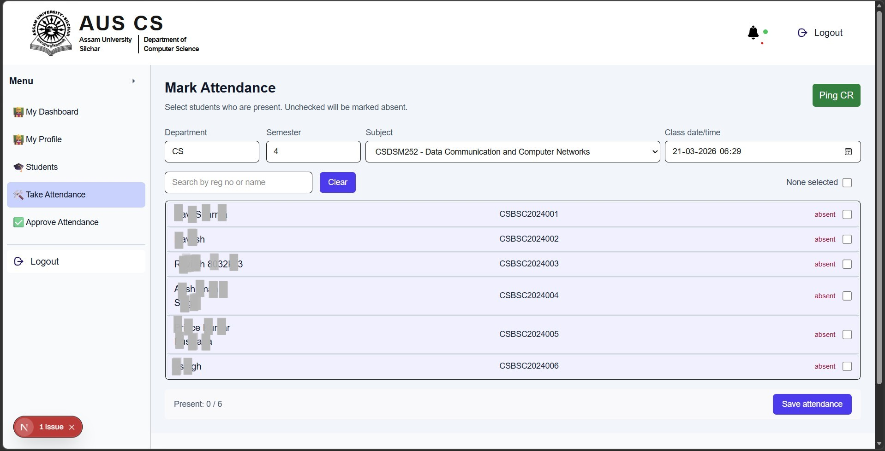
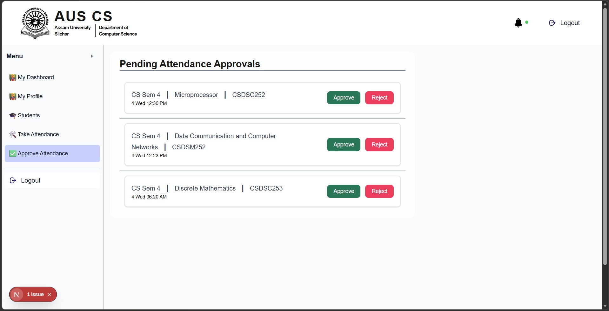
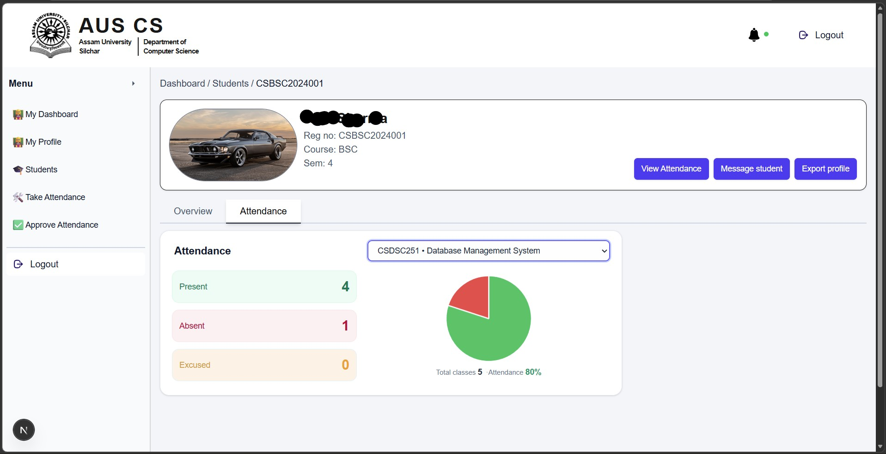
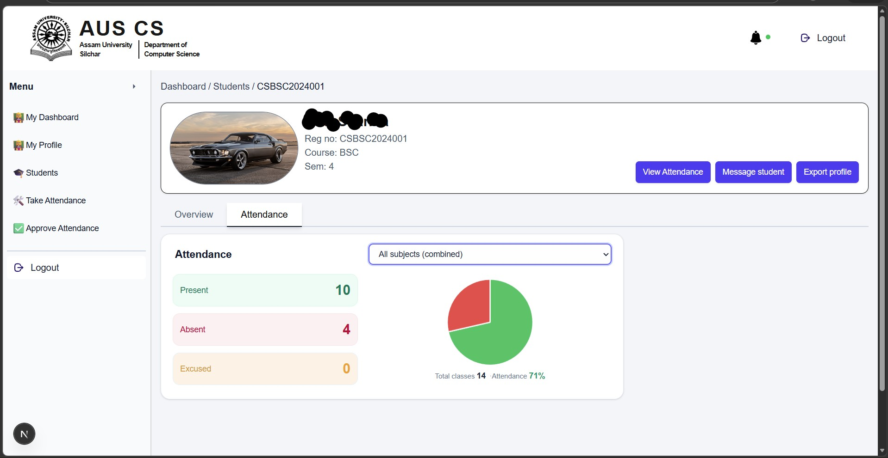
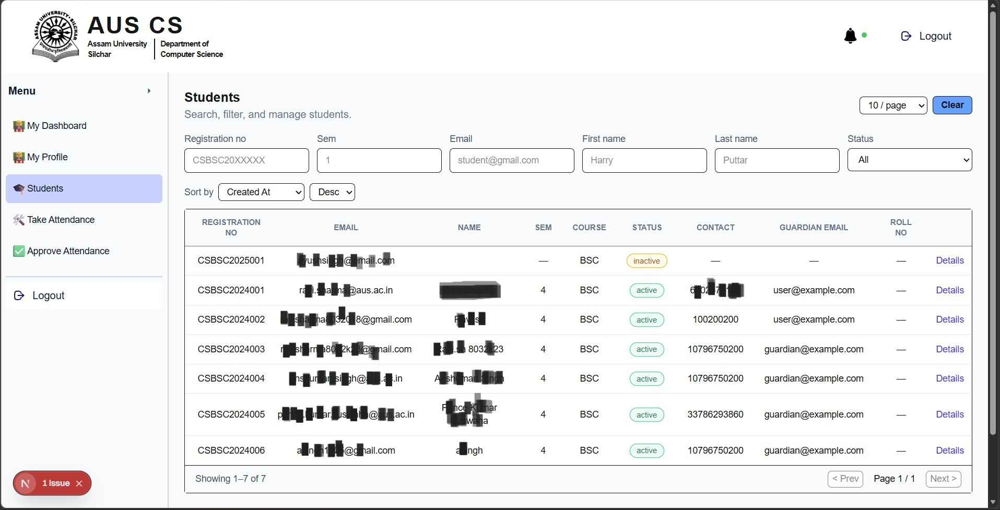
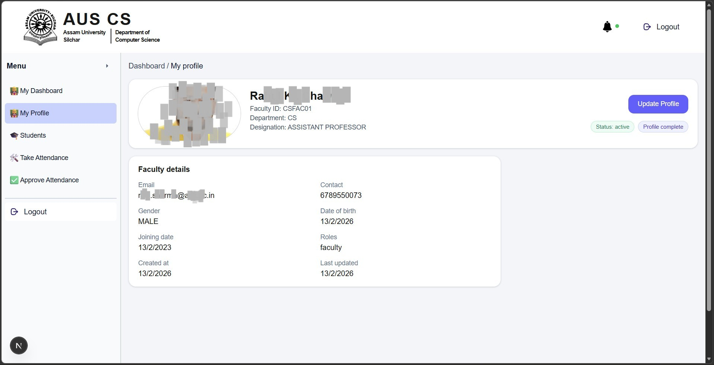

# Attendance System

A modular attendance management system for tracking, reviewing, and managing attendance records across classes and departments.


---

## Table of Contents

- [Overview](#overview)
- [Features](#features)
- [Screenshots](#screenshots)
  - [Dashboard](#dashboard)
  - [Take Attendance](#take-attendance)
  - [Approve / Review Attendance](#approve--review-attendance)
  - [Attendance Reports](#attendance-reports)
  - [Notifications](#notifications)
  - [User & Role Management](#user--role-management)
  - [Settings / Configuration](#settings--configuration)
- [Architecture](#architecture)
- [Tech Stack](#tech-stack)
- [Getting Started](#getting-started)
  - [Prerequisites](#prerequisites)
  - [Installation](#installation)


---

## Overview

This repository contains an attendance management system built to simplify daily attendance workflows such as marking, approving, and analyzing attendance data.

It is designed to be extensible, so you can adapt it for schools, universities, offices, or any organization that needs structured attendance tracking.

---

## Features

- Role-based access for admins, faculty, and regular users.
- Intuitive dashboard for quick overview of attendance stats.
- Daily attendance marking interface with filters (by class, date, department, etc.).
- Attendance approval / review flow for supervisors or admins.
- Centralized attendance reports with per-user and per-day views.
- Notification system for important events (e.g., pending approvals, low attendance, leaves).
- Search, filter, and pagination for large attendance datasets.
- Export / download capabilities (e.g., CSV, Excel) for reports. 
- Configurable settings (e.g., working days, thresholds, grace periods, holidays).
- Extensible architecture to plug in additional modules as needed.

---

## Screenshots

### Dashboard

High-level overview of attendance statistics, quick actions, and recent activity.



---

### Take Attendance

Screen for marking daily attendance for a particular class, batch, or team.



---

### Approve / Review Attendance

Interface for admins or faculty to approve, reject, or modify attendance entries.



---

### Attendance Reports

Detailed reports by date, user, class, department, or custom filters.




---

### User & Role Management

Manage users, roles, and permissions for the system.



---

### Profile Management

Show own profile and details



---

## Architecture

At a high level, the system is organized into:

- **Client / UI**  
  Responsible for rendering dashboards, forms, and tables, and for interacting with the backend via APIs.

- **Backend / API**  
  Exposes endpoints for attendance operations (mark, approve, list, report), user management, authentication, and notifications.

- **Database**  
  Stores users, roles, attendance records, notifications, and configuration data.

- **Background Jobs / Cron**  
  For scheduled tasks such as sending reminders, generating summary reports, sending mails or cleaning up stale data.

---

## Tech Stack

- **Frontend:** React, Next.js, HTML/CSS, JS/TS
- **Backend:** FastAPI, Node.js, Python
- **Database:** MongoDB
- **Authentication:** JWT-based auth, session-based auth, OAuth
- **Other:** Pydantic Models for Validation, WebSockets for real-time updates

---

## Getting Started

### Prerequisites

- Programming runtime(s), for example:
  - Node.js `v22.18.0`
  - Python `3.10.11`
- [ ] Database server `MongoDB`
- [ ] Package managers `npm`

---

### Installation

Clone the repository:

```bash
git clone https://github.com/ravi8032018/Attandance_System.git
cd Attandance_System
